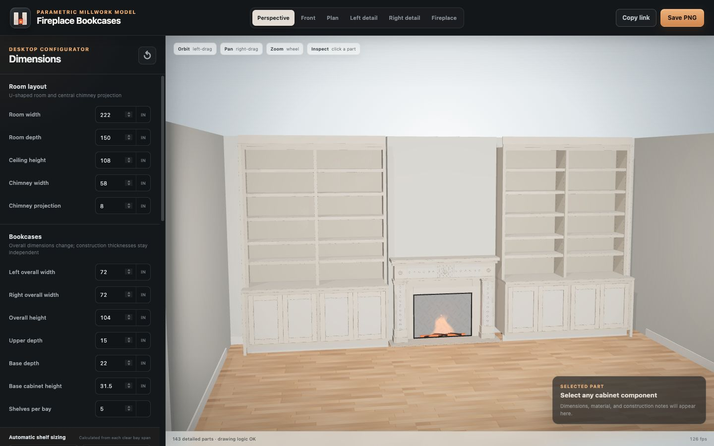

# Fireplace Bookcases — Parametric 3D Study



A completely new, standalone Three.js project for the supplied fireplace-wall layout. It models the room shell, central fireplace/chimney breast, and two detailed built-in bookcases. Overall dimensions are parametric while drawing-derived construction thicknesses remain independent of overall resizing.

## Included in the baseline

- Two matching built-in bookcases with two upper bays per side.
- Four lower Shaker doors per bookcase, recessed panels, face frames, hardware, interior shelves, finished backs, toe kicks, levelers, one outboard finished filler with plywood backer, one fixed 1-1/4-inch transition/counter, and a flat field-fit top/crown filler.
- Adjustable upper shelves with visible 5 mm pin rows on 2-inch centers.
- Automatic drawing-based shelf-span logic: 1-inch MDF through 27 inches, 1-1/4-inch MDF through 31 inches, 1-1/2-inch MDF through 36 inches, and a support warning above 36 inches.
- Central chimney breast with a painted classical surround, low hearth, recessed herringbone firebox, relief-paneled mantel and pilasters, electric insert, logs, grate, embers, and restrained animated flames.
- Room floor, back wall, side returns, baseboard, lighting, shadows, camera presets, dimension callouts, finish options, part inspection, URL share state, and PNG export.

## Fixed drawing-derived construction values

| Item | Rule |
|---|---:|
| Carcass material | 3/4 in |
| Finished back | 1/4 in |
| Face-frame rails and stiles | 1-1/2 in |
| Door thickness | 3/4 in |
| Fixed transition shelf | 1-1/4 in |
| Shelf-pin diameter | 5 mm |
| Shelf-pin spacing | 2 in |
| Minimum side filler | 3/4 in |

The supplied detail establishes construction rules but not a complete overall dimension schedule. Current overall values are editable visual-study assumptions, not fabrication dimensions.

## Default study dimensions

| Parameter | Default |
|---|---:|
| Room | 222 W × 150 D × 108 H in |
| Each bookcase | 72 W × 104 H in |
| Base cabinet | 31-1/2 H × 22 D in |
| Upper cabinet | 15 D in |
| Chimney breast | 58 W × 8 projection in |
| Fireplace opening | 32 W × 24 H in |

## Run locally

Node.js 22.12 or newer is required.

```bash
npm ci
npm run dev
```

The project is desktop-focused and intentionally has no separate mobile version.

## Verify and build

```bash
npm test
npm run check
npm run build
npm run verify
npm run preview
```

`npm run verify` runs the type check, automated tests, and production build. Vite writes the deployable site to `dist/`.

## GitHub Pages

The repository includes `.github/workflows/deploy-pages.yml`; pushes to `main` run the full verification chain before publishing through GitHub Pages.

- Repository: [github.com/ZimaP/fireplace-bookcases-3d](https://github.com/ZimaP/fireplace-bookcases-3d)
- Live site: [zimap.github.io/fireplace-bookcases-3d](https://zimap.github.io/fireplace-bookcases-3d/)

## Source layout

```text
src/
  main.ts                 Renderer, cameras, picking, rebuild lifecycle
  model/
    config.ts             Parameters, constraints, derived layout, URL state
    materials.ts          Procedural finish and fire materials
    room.ts               Room shell and floor
    bookcase.ts           Detailed parametric millwork geometry
    fireplace.ts          Mantel, surround, insert, hearth, and fire
    dimensions.ts         3D dimension lines and HTML labels
    primitives.ts         Geometry helpers, metadata, edge treatment, cleanup
    sceneBuilder.ts       Complete scene assembly and lighting
  ui/
    controls.ts           Desktop dimensions, views, and display controls
reference/                Supplied drawing and room-layout references
```

## Codex collaboration files

- [`AGENTS.md`](AGENTS.md): repository-wide rules.
- [`PROJECT_STATUS.md`](PROJECT_STATUS.md): shared current-state ledger.
- [`CODEX_HANDOFF.md`](CODEX_HANDOFF.md): architecture and takeover mission.
- [`CODEX_START_PROMPT.md`](CODEX_START_PROMPT.md): ready-to-paste first task.
- [`GITHUB_CODEX_SETUP.md`](GITHUB_CODEX_SETUP.md): repository, Pages, and Codex connection steps.

## Reference basis

- `reference/bookcase-detail-drawing.png`
- `reference/room-fireplace-layout.jpg`

See [`MODEL_SPEC.md`](MODEL_SPEC.md) for the geometry-to-drawing mapping and scope boundaries.
