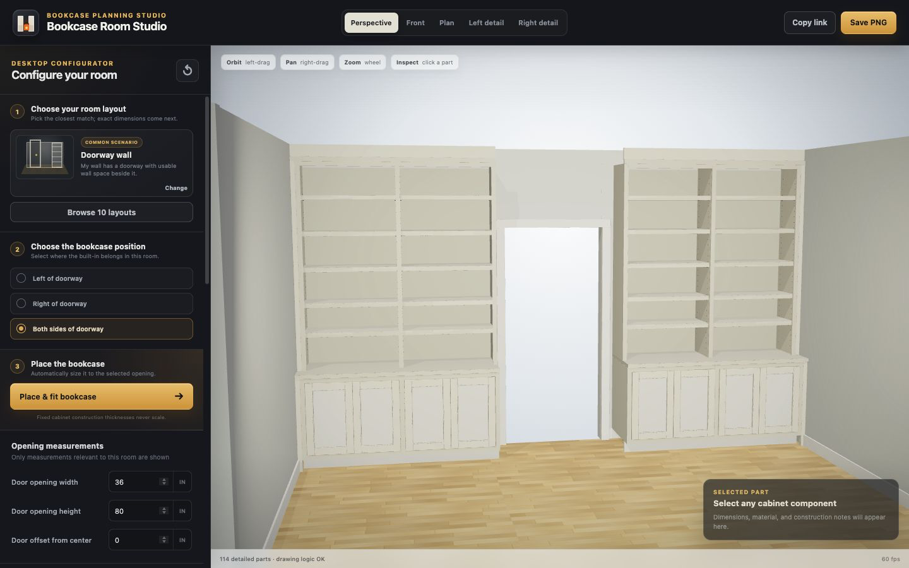
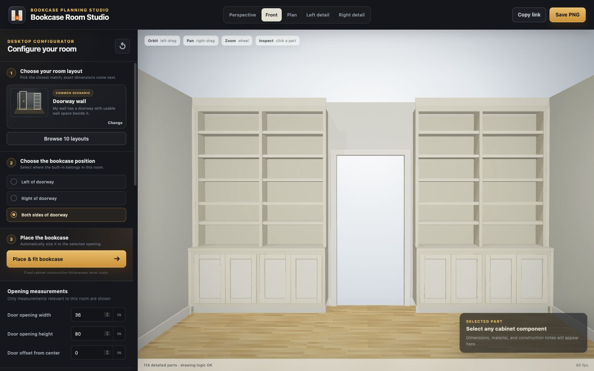
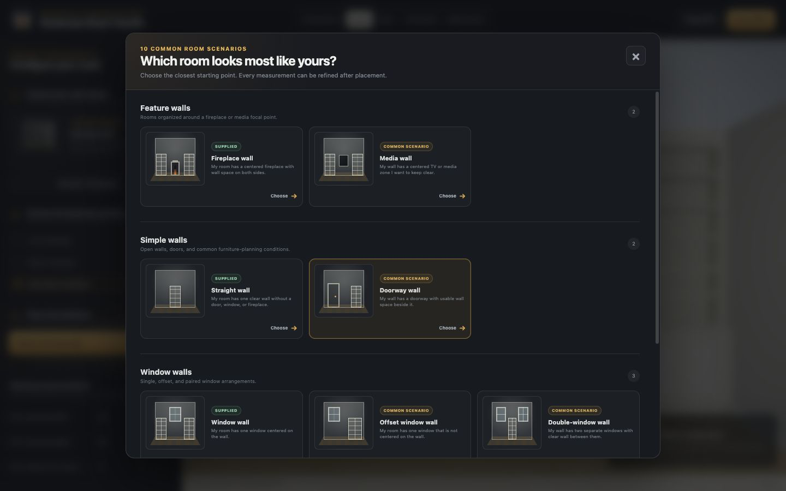

# Fireplace Bookcases — Parametric 3D Catalog







A completely new, standalone Three.js project for helping a customer identify the room condition closest to their home, choose where a built-in belongs, and fit the shared drawing-based bookcase into that opening. The current desktop catalog contains ten room scenarios: five interpreted from owner-supplied images and five generated planning studies. Room/opening dimensions and cabinet placement are parametric while drawing-derived construction thicknesses remain independent of overall resizing.

The images above document the current ten-layout desktop workflow and the unchanged shared bookcase construction.

## Customer workflow

1. **Choose your room layout** from a grouped card catalog. Each card asks the customer to recognize a physical room condition rather than understand technical cabinet terminology.
2. **Choose the bookcase position** from the valid targets for that room.
3. **Place & fit bookcase** to size only the active unit or units to the selected clear opening.
4. Refine the editable room/opening assumptions and overall bookcase dimensions, then share the URL or export a PNG.

The interface labels owner-image interpretations as **Supplied** and the five generated archetypes as **Common scenario**. Common scenarios are starting points only; they are not field surveys or new owner references.

## Included in the current catalog work

- Ten desktop room scenarios grouped as feature walls, simple walls, window walls, and recesses.
- Layout-specific placement choices and a fit command that rounds active bookcase widths down to the nearest 1/8 inch without exceeding an opening.
- One or two detailed bookcases as appropriate to the selected scenario, each retaining two upper bays and four lower Shaker doors.
- Field-fit filler, plywood backer, face frames, finished backs, toe kick, levelers, lower shelves, fixed transition top, adjustable shelves, shelf-pin rows, hardware, and flat field-fit top filler.
- Automatic drawing-based shelf stock: 1-inch MDF through 27 inches, 1-1/4-inch MDF over 27 through 31 inches, 1-1/2-inch MDF over 31 through 36 inches, and 1-1/2-inch geometry with a support warning above 36 inches.
- Layout-aware room shells, lighting, shadows, camera presets, dimension callouts, finish options, part inspection, active-only URL share state, and PNG export.
- The drawing-based fireplace and mantel remain exclusive to the supplied fireplace-wall scenario.

Alternative bookcase designs are intentionally outside this phase. Every scenario currently uses the same shared construction generator.

## Room scenarios and placement targets

| Scenario | Source | Default placement | Available placement targets | Editable layout assumptions |
|---|---|---|---|---|
| Fireplace wall | Owner-supplied image | Pair flanking fireplace | Paired left/right openings | Chimney width and projection |
| Straight wall | Owner-supplied image | Centered wall position | Left, center, or right study span | Available wall span |
| Window wall | Owner-supplied image | Both sides of centered window | Left, right, or both sides | Window width, height, and sill height |
| Center niche | Owner-supplied image | Centered in niche | Center niche opening | Niche clear width and recess depth |
| Deep/offset alcove | Owner-supplied image pair | Centered on rear wall | Alcove rear wall | Alcove clear width and depth |
| Doorway wall | Generated catalog study | Both sides of doorway | Left, right, or both sides | Door width, height, and horizontal offset |
| Offset window wall | Generated catalog study | Both unequal side zones | Left, right, or both sides | Window width, height, sill height, and horizontal offset |
| Double-window wall | Generated catalog study | Between windows | Between the windows or outside both windows | Window width, height, sill height, and clear trim-to-trim gap |
| Media wall | Generated catalog study | Both sides of media zone | Left, right, or both sides | Reserved media-zone width and height |
| Side nook | Generated catalog study | Left-side nook | Left or right recessed nook | Nook clear width and recess depth |

Changing scenarios loads that room's study defaults, normalizes its placement target, and preserves shared cabinet/presentation preferences. **Place & fit bookcase** changes active overall widths only. It does not alter fixed cabinet construction values.

The generated scenarios reflect frequently encountered built-in conditions rather than measured popularity rankings. General precedent includes This Old House guidance on locating built-ins around walls, windows, doors, alcoves, and other overlooked areas: [Bookcase Basics](https://www.thisoldhouse.com/moving/bookcase-basics) and [7 Surprising Built-In Bookcase Designs](https://www.thisoldhouse.com/furniture/7-surprising-built-in-bookcase-designs). Additional small-space and built-in planning context is available from Architectural Digest: [living-room layout guidance](https://www.architecturaldigest.com/story/living-room-furniture-layout-maximizes-small-space) and [built-in bookshelf approaches](https://www.architecturaldigest.com/story/ways-to-hack-built-in-bookshelves). These links support the catalog categories; they do not supply this project's geometry or fabrication dimensions.

## Fixed drawing-derived construction values

| Item | Rule |
|---|---:|
| Carcass material | 3/4 in |
| Finished back | 1/4 in |
| Face-frame rails and stiles | 1-1/2 in |
| Door thickness | 3/4 in |
| Fixed transition shelf | 1-1/4 in |
| Shelf-pin diameter | 5 mm |
| Shelf-pin spacing | 2 in |
| Minimum side filler | 3/4 in |

The supplied detail establishes construction rules but not a complete overall dimension schedule. Current overall values are editable visual-study assumptions, not fabrication dimensions.

## Default visual-study dimensions

| Scenario or shared item | Default |
|---|---:|
| Fireplace room | 222 W × 150 D × 108 H in; chimney 58 W × 8 projection in |
| Straight wall | 180 W × 132 D × 108 H in; 72-inch available study span |
| Centered-window wall | 180 W × 132 D × 108 H in; window 48 W × 42 H in with 40-inch sill |
| Center niche | 180 W × 132 D × 108 H in; niche 72 W × 24 D in |
| Deep/offset alcove | 84 W × 150 D × 108 H in; 84-inch clear rear wall |
| Doorway wall | 180 W × 132 D × 108 H in; opening 36 W × 80 H in, centered; 3-inch study casing |
| Offset-window wall | 192 W × 132 D × 108 H in; window 48 W × 42 H in, 40-inch sill, 8 inches right of center |
| Double-window wall | 264 W × 132 D × 108 H in; two 36 W × 48 H-in windows, 30-inch sill, 72-inch clear trim-to-trim gap |
| Media wall | 222 W × 132 D × 108 H in; reserved zone 72 W × 50 H in |
| Side nook | 180 W × 132 D × 108 H in; nook 72 W × 24 D in |
| Shared bookcase | 72 W × 104 H in before scenario fitting |
| Base / upper cabinet | 31-1/2 H × 22 D / 15 D in |
| Fireplace opening | 32 W × 24 H in |

All room, doorway, window, niche, alcove, media-zone, nook, and overall cabinet values above are editable visual-study assumptions rather than field-verified fabrication dimensions.

## Run locally

Node.js 22.12 or newer is required.

```bash
npm ci
npm run dev
```

The project is desktop-focused and intentionally has no separate mobile version.

## Verify and build

```bash
npm test
npm run check
npm run build
npm run verify
npm run preview
```

`npm run verify` runs the type check, automated tests, and production build. Vite writes the deployable site to `dist/`.

## GitHub Pages

The repository includes `.github/workflows/deploy-pages.yml`; pushes to `main` run the full verification chain before publishing through GitHub Pages.

- Repository: [github.com/ZimaP/fireplace-bookcases-3d](https://github.com/ZimaP/fireplace-bookcases-3d)
- Live site: [zimap.github.io/fireplace-bookcases-3d](https://zimap.github.io/fireplace-bookcases-3d/)

The ten-layout catalog is published and live-browser-verified on GitHub Pages. Verification details are recorded in [`PROJECT_STATUS.md`](PROJECT_STATUS.md).

## Source layout

```text
src/
  main.ts                 Renderer, cameras, picking, rebuild lifecycle
  model/
    config.ts             Scenario catalog, parameters, constraints, derived layout, URL state
    materials.ts          Procedural finish and fire materials
    room.ts               Layout-aware room shells and architectural openings
    bookcase.ts           Detailed parametric millwork geometry
    fireplace.ts          Mantel, surround, insert, hearth, and fire
    dimensions.ts         3D dimension lines and HTML labels
    primitives.ts         Geometry helpers, metadata, edge treatment, cleanup
    sceneBuilder.ts       Complete scene assembly and lighting
  ui/
    controls.ts           Desktop catalog workflow, dimensions, views, and display controls
reference/                Owner-supplied drawing and room-layout references
```

## Codex collaboration files

- [`AGENTS.md`](AGENTS.md): repository-wide rules.
- [`PROJECT_STATUS.md`](PROJECT_STATUS.md): shared current-state ledger.
- [`CODEX_HANDOFF.md`](CODEX_HANDOFF.md): architecture and takeover mission.
- [`CODEX_START_PROMPT.md`](CODEX_START_PROMPT.md): ready-to-paste first task.
- [`GITHUB_CODEX_SETUP.md`](GITHUB_CODEX_SETUP.md): repository, Pages, and Codex connection steps.

## Owner-supplied reference basis

- `reference/bookcase-detail-drawing.png`
- `reference/room-fireplace-layout.jpg`
- `reference/layout-straight-wall.jpg`
- `reference/layout-window-wall.jpg`
- `reference/layout-center-niche.jpg`
- `reference/layout-deep-alcove-left.jpg`
- `reference/layout-deep-alcove-right.jpg`

The five generated catalog scenarios have no owner-reference images and must not be presented as though they do. The paired source views identified as IMG_6777 and IMG_6778 are modeled as the deep/offset alcove, but they may instead be oblique documentation related to IMG_6768. That relationship and every room/opening dimension require owner or field confirmation.

See [`MODEL_SPEC.md`](MODEL_SPEC.md) for the geometry-to-drawing mapping and scope boundaries.
