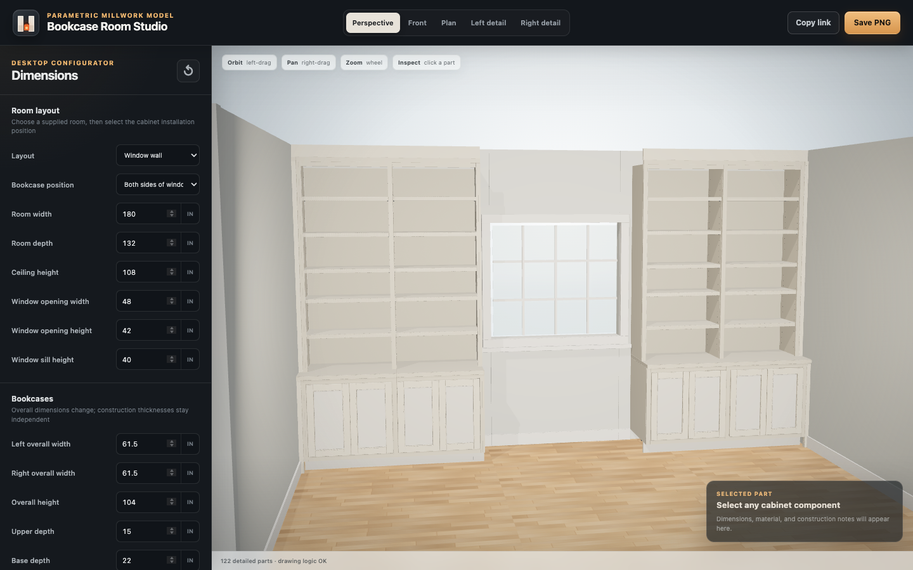
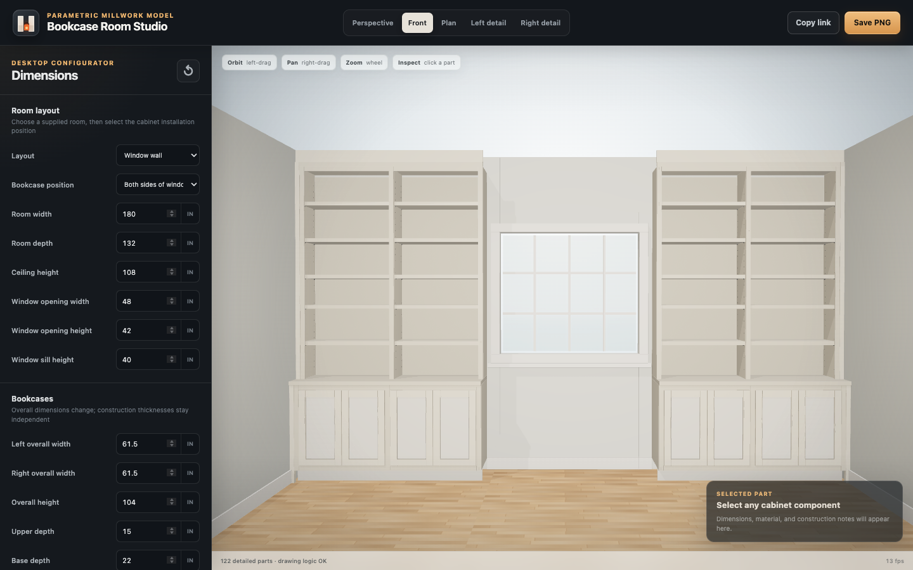

# Fireplace Bookcases — Parametric 3D Study





A completely new, standalone Three.js project for studying the drawing-based built-in bookcases in five supplied room layouts. Room/opening dimensions and cabinet placement are parametric while drawing-derived construction thicknesses remain independent of overall resizing.

## Included in the current study

- Five selectable room presets: fireplace wall, straight wall, window wall, center niche, and deep/offset alcove.
- Layout-specific bookcase positions and a fit-to-opening command that sizes only the active unit or units to the selected clear opening.
- One or two detailed bookcases as appropriate to the selected layout, with two upper bays per unit.
- Four lower Shaker doors per bookcase, recessed panels, face frames, hardware, interior shelves, finished backs, toe kicks, levelers, one outboard finished filler with plywood backer, one fixed 1-1/4-inch transition/counter, and a flat field-fit top/crown filler.
- Adjustable upper shelves with visible 5 mm pin rows on 2-inch centers.
- Automatic drawing-based shelf-span logic: 1-inch MDF through 27 inches, 1-1/4-inch MDF through 31 inches, 1-1/2-inch MDF through 36 inches, and a support warning above 36 inches.
- In the fireplace preset, a central chimney breast with painted classical surround, low hearth, recessed herringbone firebox, relief-paneled mantel and pilasters, electric insert, logs, grate, embers, and restrained animated flames.
- Layout-specific room shells, floor, walls, baseboards, window/niche/alcove details, lighting, shadows, camera presets, dimension callouts, finish options, part inspection, URL share state, and PNG export.

## Room presets and placement targets

| Preset | Default placement | Available placement targets | Editable layout dimensions |
|---|---|---|---|
| Fireplace wall | Pair flanking fireplace | Paired left/right openings | Chimney width and projection |
| Straight wall | Centered wall position | Left, center, or right study span | Wall study-span width |
| Window wall | Both sides of window | Left, right, or both sides | Window width, height, and sill height |
| Center niche | Centered in niche | Center niche opening | Niche clear width and recess depth |
| Deep/offset alcove | Centered on rear wall | Alcove rear wall | Alcove clear width and depth |

Changing presets loads that room's study defaults. **Fit selected opening** rounds the active bookcase width down to the nearest 1/8 inch without exceeding the available opening; paired layouts fit both active units. It does not alter fixed cabinet construction values.

## Fixed drawing-derived construction values

| Item | Rule |
|---|---:|
| Carcass material | 3/4 in |
| Finished back | 1/4 in |
| Face-frame rails and stiles | 1-1/2 in |
| Door thickness | 3/4 in |
| Fixed transition shelf | 1-1/4 in |
| Shelf-pin diameter | 5 mm |
| Shelf-pin spacing | 2 in |
| Minimum side filler | 3/4 in |

The supplied detail establishes construction rules but not a complete overall dimension schedule. Current overall values are editable visual-study assumptions, not fabrication dimensions.

## Default visual-study dimensions

| Preset or shared item | Default |
|---|---:|
| Fireplace room | 222 W × 150 D × 108 H in |
| Straight/window/niche room | 180 W × 132 D × 108 H in |
| Deep/offset alcove room | 84 W × 150 D × 108 H in |
| Straight wall study span | 72 W in |
| Window opening | 48 W × 42 H in; 40-in sill |
| Center niche | 72 W × 24 D in |
| Deep alcove | 84 W × 150 D in |
| Shared bookcase | 72 W × 104 H in before layout fitting |
| Base / upper cabinet | 31-1/2 H × 22 D / 15 D in |
| Chimney breast | 58 W × 8 projection in |
| Fireplace opening | 32 W × 24 H in |

All room, window, niche, alcove, and overall cabinet values above are editable visual-study assumptions rather than field-verified fabrication dimensions.

## Run locally

Node.js 22.12 or newer is required.

```bash
npm ci
npm run dev
```

The project is desktop-focused and intentionally has no separate mobile version.

## Verify and build

```bash
npm test
npm run check
npm run build
npm run verify
npm run preview
```

`npm run verify` runs the type check, automated tests, and production build. Vite writes the deployable site to `dist/`.

## GitHub Pages

The repository includes `.github/workflows/deploy-pages.yml`; pushes to `main` run the full verification chain before publishing through GitHub Pages.

- Repository: [github.com/ZimaP/fireplace-bookcases-3d](https://github.com/ZimaP/fireplace-bookcases-3d)
- Live site: [zimap.github.io/fireplace-bookcases-3d](https://zimap.github.io/fireplace-bookcases-3d/)

The five-layout release is published and browser-verified on GitHub Pages.

## Source layout

```text
src/
  main.ts                 Renderer, cameras, picking, rebuild lifecycle
  model/
    config.ts             Parameters, constraints, derived layout, URL state
    materials.ts          Procedural finish and fire materials
    room.ts               Room shell and floor
    bookcase.ts           Detailed parametric millwork geometry
    fireplace.ts          Mantel, surround, insert, hearth, and fire
    dimensions.ts         3D dimension lines and HTML labels
    primitives.ts         Geometry helpers, metadata, edge treatment, cleanup
    sceneBuilder.ts       Complete scene assembly and lighting
  ui/
    controls.ts           Desktop dimensions, views, and display controls
reference/                Supplied drawing and room-layout references
```

## Codex collaboration files

- [`AGENTS.md`](AGENTS.md): repository-wide rules.
- [`PROJECT_STATUS.md`](PROJECT_STATUS.md): shared current-state ledger.
- [`CODEX_HANDOFF.md`](CODEX_HANDOFF.md): architecture and takeover mission.
- [`CODEX_START_PROMPT.md`](CODEX_START_PROMPT.md): ready-to-paste first task.
- [`GITHUB_CODEX_SETUP.md`](GITHUB_CODEX_SETUP.md): repository, Pages, and Codex connection steps.

## Reference basis

- `reference/bookcase-detail-drawing.png`
- `reference/room-fireplace-layout.jpg`
- `reference/layout-straight-wall.jpg`
- `reference/layout-window-wall.jpg`
- `reference/layout-center-niche.jpg`
- `reference/layout-deep-alcove-left.jpg`
- `reference/layout-deep-alcove-right.jpg`

The paired source views identified as IMG_6777 and IMG_6778 are modeled as the deep/offset alcove, but they may instead be oblique documentation related to IMG_6768. That relationship and every new room/opening dimension require owner or field confirmation.

See [`MODEL_SPEC.md`](MODEL_SPEC.md) for the geometry-to-drawing mapping and scope boundaries.
